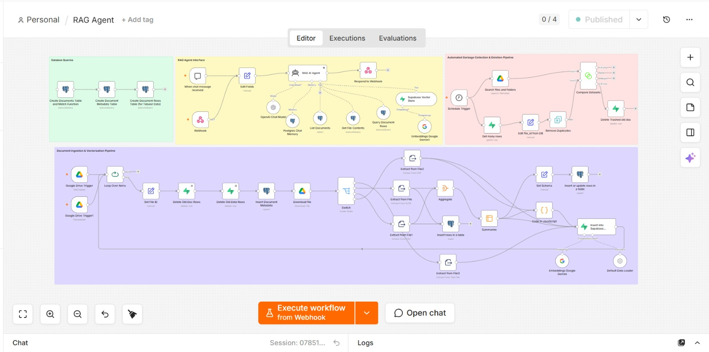

# RAG Agent (n8n Workflow)

An n8n workflow that implements a Retrieval-Augmented Generation (RAG) agent backed by
Supabase (vector store), Postgres (metadata/chat memory), and Google Drive (document
source), with Google Gemini embeddings and an OpenAI-powered chat agent.

## Overview

The workflow is organized into four sub-pipelines:

### 1. Database Queries (setup)
One-time/manual Postgres queries that provision the tables and functions the rest of
the workflow depends on:
- **Create Documents Table and Match Function** — vector documents table + similarity search function
- **Create Document Metadata Table** — tracks source files and titles
- **Create Document Rows Table (for Tabular Data)** — stores structured rows extracted from spreadsheets/CSVs

### 2. RAG Agent Interface
The user-facing chat interface:
- Triggered via **chat message** or an authenticated **Webhook**
- **RAG AI Agent** (OpenAI Chat Model + Postgres Chat Memory) answers using tools:
  - **List Documents**, **Get File Contents**, **Query Document Rows** (Postgres tools)
  - **Supabase Vector Store** (semantic search) with **Google Gemini Embeddings**
- Responds back over the webhook

### 3. Document Ingestion & Vectorization Pipeline
Watches Google Drive for new/changed files, processes them, and indexes them:
- **Google Drive Trigger(s)** → **Loop Over Items**
- Removes stale rows for a file (**Delete Old Doc Rows**, **Delete Old Data Rows**), then re-inserts metadata
- Downloads the file and **Switch**es on file type to the right extractor (PDF / Excel / CSV / plain text)
- Tabular data is aggregated, summarized, and inserted into a structured rows table
- All content is embedded (**Google Gemini Embeddings**) and inserted into the **Supabase Vector Store**

### 4. Automated Garbage Collection & Deletion Pipeline
Runs on a **Schedule Trigger** to keep the vector store in sync with Google Drive:
- Lists current files/folders in Drive, compares against what's stored in Supabase
- Removes duplicate/stale rows and deletes vector entries for files that were trashed/removed in Drive

## Requirements

- [n8n](https://n8n.io/) (self-hosted or cloud)
- Credentials configured in your n8n instance for:
  - Google Drive (OAuth2)
  - Supabase
  - Postgres
  - OpenAI
  - Google Gemini (PaLM API)
  - Header Auth (for the webhook)

> The exported workflow JSON only references credential **names/IDs** from the original
> n8n instance — no secrets are included. You'll need to reconnect each credential to
> your own accounts after importing.

## Setup

1. Import `RAG_Agent.json` into your n8n instance (**Workflows → Import from File**).
2. Reconnect each credential (Google Drive, Supabase, Postgres, OpenAI, Google Gemini, Header Auth) to your own accounts.
3. Run the **Database Queries** group manually once to provision your Supabase/Postgres schema.
4. Activate the Google Drive triggers to start ingesting documents.
5. Use **Open chat** or call the webhook to talk to the agent.

## License

MIT (or update to your preferred license).
